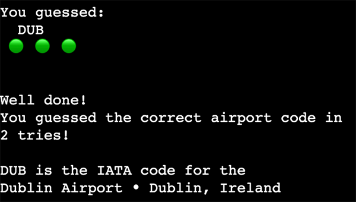
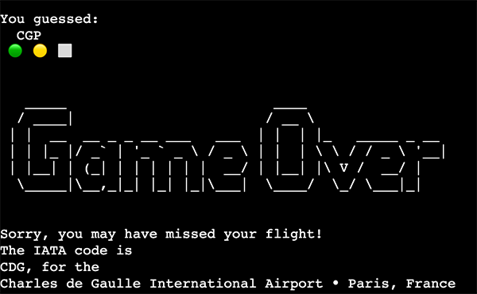

 
Live site at [https://airport-codes-game.herokuapp.com/](https://airport-codes-game.herokuapp.com/)

# Description 
The "Guess the Airport Game" is inspired by the well-known web-based game [Wordle](https://en.wikipedia.org/wiki/Wordle), where the players have six tries to guess a five-letter word, with feedback given for each guess in the form of coloured tiles indicating when letters match or occupy the correct position. 
If you still haven't played Wordle, you can play it free at [The New York Times website](https://www.nytimes.com/games/wordle/index.html).
As a Wordle fan and an aviation geek, I decided to program the "Guess The Aiport Game", where the players have six attempts to guess the three-letter [IATA code](https://en.wikipedia.org/wiki/IATA_airport_code) for an airport.  
Searching online, I found a couple of tutorials showing that it was possible to code a Wordle game in Python; some were more advanced and included Python libraries. So I started this project following a tutorial on the YouTube channel ["CompSci with Dr. Victor"](https://www.youtube.com/@CompSciwithDrVictor), under the title ["Text-Based Wordle in Python under 15 Minutes!"](https://www.youtube.com/watch?v=J6h7D2iQmBU) No need to say that it took me way over 15 minutes. 

# Logic
(Flow Chart)

# Features
## Introduction, menu and rules

 
At the start of every new game, the player is greeted with an [ASCII art](https://en.wikipedia.org/wiki/ASCII) and, introduction text and a menu where they can choose to read the rules, play a new game, read the game credits or quit. 

The menu is also displayed at the end of the games. 

The introduction, ASCII art, rules and credits are stored in a separate python file.

## Hitns and Airports
Some IATA codes are the initials of the name of the airport they represent (e.g. JFK for John Fitzgerald Kennedy, New York) or abbreviations of the city where they are located (e.g. DUB for Dublin Airport). However, in many cases, there is no clear association between the airport and its code (e.g. YYZ for Toronto Pearson International Airport). 

Also,  asking the players to guess any three-letter code could lead to frustration. They could spend all their six attempts before getting any clue.   

Instead, a hint about the airport's location is displayed at the start of every new game to make the game easier to play. Also, the list of airports is limited to the one-hundred busiest airports in Europe and North America. 

The list of airports and hints are in two different dictionaries in a separate python file. 

## Clues
The game displays a line below the player's guess with [Emojis](https://en.wikipedia.org/wiki/Emoji) to provide feedback if the letters in the player's input match the ones in the airport code: 

- 🟢 The green circle emoji indicates that the letter is in the code and the correct position.
- 🟡 The yellow circle emoji means the letter is in the code but not in the right place.
- ⬜️ The grey square indicates that the letter is not part of the code.

All the player's attempts remain visible on the screen until the game is reset. 

## End-of-game feedback
The game ends when the player uses all their six tries or when they correctly guess the three letters of the airport code in the correct positions. 
There are three different feedback given according to the outcome: 

1 - The players guess on the first try: 

2 - The players guess correctly using more than one try: 

3 - The players use all their tries and don't guess correctly: 

In all cases, the feedback presents the correct IATA code with the airport name and location, followed by the game menu. 

## Input validation
Every time the user inputs a value, the game checks if it is a valid three-letter code, and converts the letters to uppercase to fit if the IATA code standards. 
 In case of an invalid input the player will see one of the following messages:  
 * The player's guess has lenth different than three letters: 
 

 * The playe's guess contains numbers or symblos:  
  

# Testing
## PEP8 Validator Testing
The game has been tested by running it through the PeP8.
The final version of the run.py file have no issues. 
The file containing the ASCII art presents errors due to trailing whitespaces or "invalid escape sequence '\_' ".

## Manual Testing
The game has been tested on Google Chrome and Firefox for desktop and mobile with no significant issues. 

## Unfixed bugs
There is a problem when the game loads for the first time the introduction screen, with the ASCII, is not displayed entirely.  

Also, when a player enters a guess with repeated letters, if the letter is just in the airport code, the feedback will be green for the letter in the correct place and yellow for the repeated letter because it is in the guess code. 

For example: If the IATA code is "DUB", and the user enters "UUU", the clue will be "Yellow-Green-Yellow". It could be better to indicate that if the letter had already been guessed, the repeated occurrences should be marked as not in the airport code. 

I could not fix these issues, but they only affected a little game experience. 

# Deployment 
This site was deployed with the Code Institute template for Heroku. 
The steps to deploy are:
* At Heroku dashboard,  click "new" and "create new app".* 
* Than, set the build packs to Python and jsnode in this order. 
* In the deploy tab connect the github repository and click on enable automatic deploy.

The delpoyed app can be found here: [https://airport-codes-game.herokuapp.com/](https://airport-codes-game.herokuapp.com/)

# Credits
* Video tutorial: [Text-Based Wordle in Python under 15 Minutes!](https://www.youtube.com/watch?v=J6h7D2iQmBU). Code from the video is available [here](https://replit.com/@DrVictor/TextBasedWordle).
* The list of airports for this game is from the web page ["Top 100 busiest airports in the world"](https://gettocenter.com/airports/top-100-airports-in-world).  I've used only airports from North America and Europe.
* A function to clear the screen was extracted from the project of a Code Institute collegue, [
James Fitzpatrick's Hangman](https://github.com/James-Fitz/hangman_python)
* Code Institute [Python Tempalte](https://github.com/Code-Institute-Org/python-essentials-template)
* ASCII art created with [Patorjk.com](https://patorjk.com/software/taag)

I would like to thank my mentor Martina Terlevic for her help in this project. 